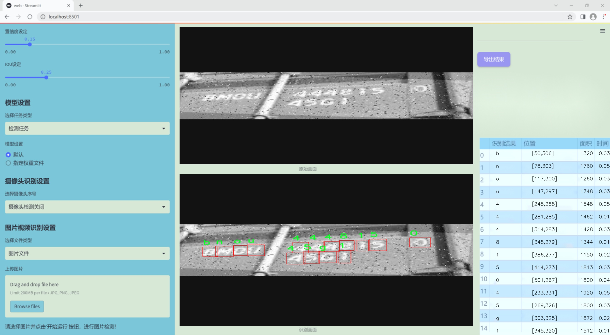
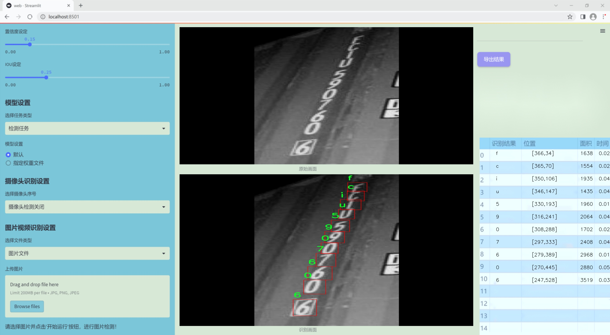
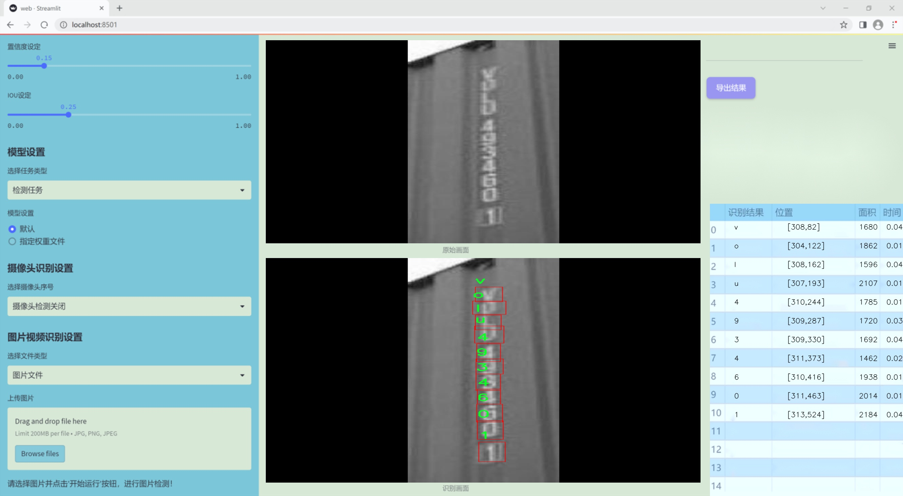
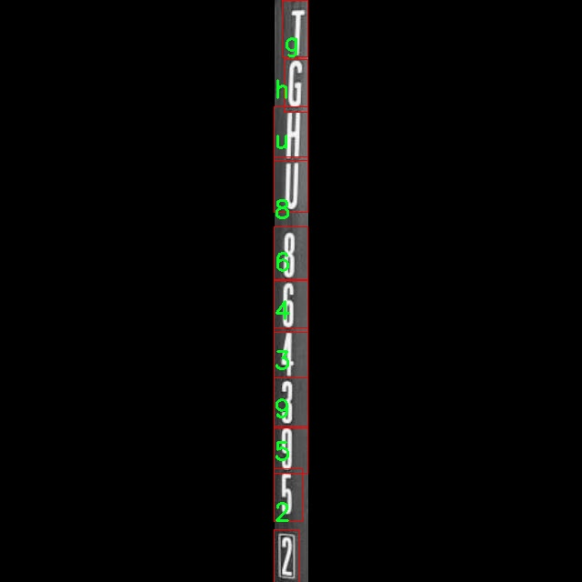
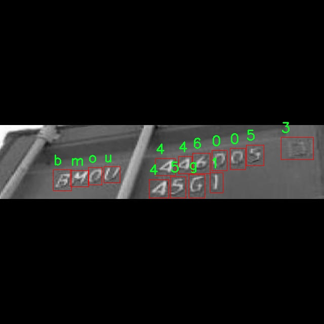
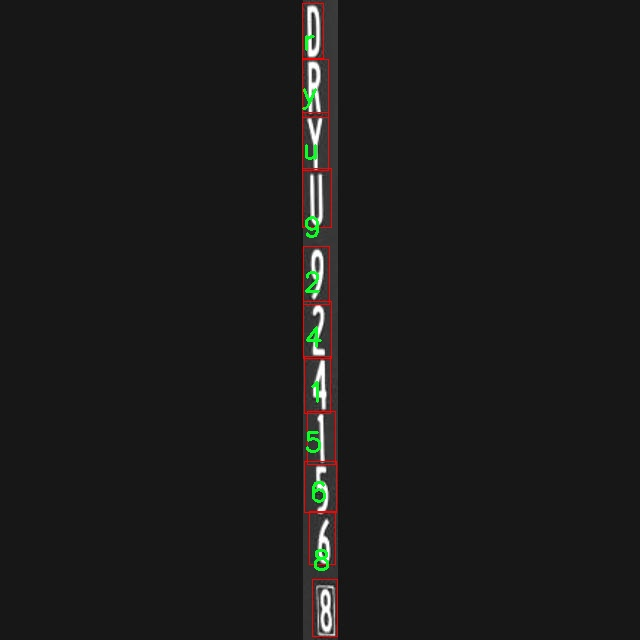
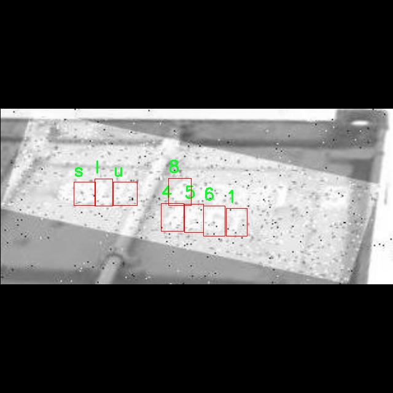
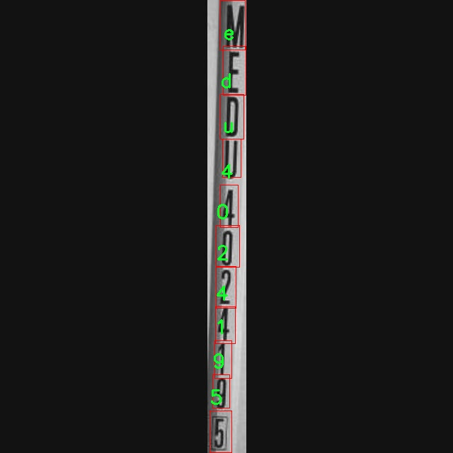

# 改进yolo11-RevCol等200+全套创新点大全：集装箱字符识别系统源码＆数据集全套

### 1.图片效果展示







##### 项目来源 **[人工智能促进会 2024.10.24](https://kdocs.cn/l/cszuIiCKVNis)**

注意：由于项目一直在更新迭代，上面“1.图片效果展示”和“2.视频效果展示”展示的系统图片或者视频可能为老版本，新版本在老版本的基础上升级如下：（实际效果以升级的新版本为准）

  （1）适配了YOLOV11的“目标检测”模型和“实例分割”模型，通过加载相应的权重（.pt）文件即可自适应加载模型。

  （2）支持“图片识别”、“视频识别”、“摄像头实时识别”三种识别模式。

  （3）支持“图片识别”、“视频识别”、“摄像头实时识别”三种识别结果保存导出，解决手动导出（容易卡顿出现爆内存）存在的问题，识别完自动保存结果并导出到tempDir中。

  （4）支持Web前端系统中的标题、背景图等自定义修改。

  另外本项目提供训练的数据集和训练教程,暂不提供权重文件（best.pt）,需要您按照教程进行训练后实现图片演示和Web前端界面演示的效果。

### 2.视频效果展示

[2.1 视频效果展示](https://www.bilibili.com/video/BV1ZK1hYuERP/)

### 3.背景

研究背景与意义

随着全球贸易的不断发展，集装箱运输已成为国际物流的重要组成部分。集装箱上所标识的字符信息不仅包含了货物的基本信息，还涉及到运输的安全性和效率。因此，准确识别集装箱上的字符信息，对于提高物流管理的智能化水平、降低人工成本以及提升运输效率具有重要意义。传统的字符识别方法往往依赖于人工识别，效率低下且容易出现错误，难以满足现代物流行业对高效、准确的需求。

近年来，深度学习技术的快速发展为字符识别提供了新的解决方案。YOLO（You Only Look Once）系列模型因其高效的实时目标检测能力而受到广泛关注。YOLOv11作为该系列的最新版本，具有更强的特征提取能力和更快的处理速度，适合在复杂的物流环境中进行集装箱字符识别。然而，YOLOv11在处理集装箱字符识别时仍存在一些挑战，例如字符的模糊性、背景的复杂性以及不同光照条件下的识别准确率等。因此，基于YOLOv11的改进方案亟需提出，以提高其在集装箱字符识别中的表现。

本研究旨在基于改进的YOLOv11模型，构建一个高效的集装箱字符识别系统。我们将利用包含1000张图像的集装箱字符注释数据集，涵盖了数字和字母的多种类别。通过对模型进行优化，增强其对字符的检测和识别能力，力求在不同的环境条件下都能保持高准确率。此外，本研究还将探讨数据增强技术在提高模型鲁棒性方面的应用，以期为集装箱运输行业提供一种智能化的解决方案，推动物流管理的数字化转型。通过本项目的实施，预计将为集装箱字符识别技术的发展提供新的思路和方法，为行业的高效运作贡献力量。

### 4.数据集信息展示

##### 4.1 本项目数据集详细数据（类别数＆类别名）

nc: 35
names: ['0', '1', '2', '3', '4', '5', '6', '7', '8', '9', 'a', 'b', 'c', 'd', 'e', 'f', 'g', 'h', 'i', 'j', 'k', 'l', 'm', 'n', 'o', 'p', 'r', 's', 't', 'u', 'v', 'w', 'x', 'y', 'z']


该项目为【目标检测】数据集，请在【训练教程和Web端加载模型教程（第三步）】这一步的时候按照【目标检测】部分的教程来训练

##### 4.2 本项目数据集信息介绍

本项目数据集信息介绍

本项目所使用的数据集名为“container characters annotation”，旨在为改进YOLOv11的集装箱字符识别系统提供高质量的训练数据。该数据集包含35个类别，涵盖了数字和字母的所有基本字符，具体类别包括从0到9的数字以及从a到z的小写字母。这种丰富的字符组合为模型的训练提供了多样性，确保其在实际应用中能够准确识别和分类各种集装箱上的字符信息。

数据集的构建过程注重多样性和代表性，确保每个字符在不同的环境、角度和光照条件下都有充分的样本。这种设计理念使得模型在面对真实世界中的复杂情况时，能够展现出更强的鲁棒性和适应性。此外，数据集中的每个样本都经过精确的标注，确保训练过程中模型能够学习到字符的细微差别，从而提高识别的准确率。

通过使用“container characters annotation”数据集，研究团队希望能够显著提升YOLOv11在集装箱字符识别任务中的性能。该数据集不仅为模型提供了必要的训练基础，还为后续的模型评估和优化提供了可靠的数据来源。随着训练的深入，模型将能够更好地理解字符的形态特征，进而实现高效、准确的识别。

总之，本项目的数据集“container characters annotation”是一个精心设计和构建的资源，旨在推动集装箱字符识别技术的发展，为相关领域的应用提供坚实的基础。通过对该数据集的深入挖掘和利用，研究团队期待在字符识别的准确性和效率上取得显著进展。











### 5.全套项目环境部署视频教程（零基础手把手教学）

[5.1 所需软件PyCharm和Anaconda安装教程（第一步）](https://www.bilibili.com/video/BV1BoC1YCEKi/?spm_id_from=333.999.0.0&vd_source=bc9aec86d164b67a7004b996143742dc)


[5.2 安装Python虚拟环境创建和依赖库安装视频教程（第二步）](https://www.bilibili.com/video/BV1ZoC1YCEBw?spm_id_from=333.788.videopod.sections&vd_source=bc9aec86d164b67a7004b996143742dc)

### 6.改进YOLOv11训练教程和Web_UI前端加载模型教程（零基础手把手教学）

[6.1 改进YOLOv11训练教程和Web_UI前端加载模型教程（第三步）](https://www.bilibili.com/video/BV1BoC1YCEhR?spm_id_from=333.788.videopod.sections&vd_source=bc9aec86d164b67a7004b996143742dc)


按照上面的训练视频教程链接加载项目提供的数据集，运行train.py即可开始训练



     Epoch   gpu_mem       box       obj       cls    labels  img_size
     1/200     20.8G   0.01576   0.01955  0.007536        22      1280: 100%|██████████| 849/849 [14:42<00:00,  1.04s/it]
               Class     Images     Labels          P          R     mAP@.5 mAP@.5:.95: 100%|██████████| 213/213 [01:14<00:00,  2.87it/s]
                 all       3395      17314      0.994      0.957      0.0957      0.0843

     Epoch   gpu_mem       box       obj       cls    labels  img_size
     2/200     20.8G   0.01578   0.01923  0.007006        22      1280: 100%|██████████| 849/849 [14:44<00:00,  1.04s/it]
               Class     Images     Labels          P          R     mAP@.5 mAP@.5:.95: 100%|██████████| 213/213 [01:12<00:00,  2.95it/s]
                 all       3395      17314      0.996      0.956      0.0957      0.0845

     Epoch   gpu_mem       box       obj       cls    labels  img_size
     3/200     20.8G   0.01561    0.0191  0.006895        27      1280: 100%|██████████| 849/849 [10:56<00:00,  1.29it/s]
               Class     Images     Labels          P          R     mAP@.5 mAP@.5:.95: 100%|███████   | 187/213 [00:52<00:00,  4.04it/s]
                 all       3395      17314      0.996      0.957      0.0957      0.0845


###### [项目数据集下载链接](https://kdocs.cn/l/cszuIiCKVNis)

### 7.原始YOLOv11算法讲解

YOLO11采用改进的骨干和颈部架构，增强了特征提取能力，提高了物体检测的精确度和复杂任务的表现。YOLO11引入精炼的架构设计和优化的训练流程，实现更快的处理速度，同时保持精度和性能之间的最佳平衡。通过模型设计的进步，YOLO11m在COCO数据集上实现了更高的均值平均精度（mAP），同时使用比YOLOv8m少22%的参数，使其在不妥协准确性的情况下更加计算高效。YOLO11可以无缝部署在各种环境中，包括边缘设备、云平台以及支持NVIDIA
GPU的系统，确保最大灵活性。无论是物体检测、实例分割、图像分类、姿态估计，还是定向物体检测（OBB），YOLO11都旨在应对多样的计算机视觉挑战。


##### **Ultralytics YOLO11相比于之前版本的主要改进有哪些？**

Ultralytics YOLO11在其前身基础上引入了几项重要进步。主要改进包括：

  1. **增强的特征提取** ：YOLO11采用改进的骨干和颈部架构，增强了特征提取能力，提高了物体检测的精确度。
  2.  **优化的效率和速度** ：精炼的架构设计和优化的训练流程实现了更快的处理速度，同时保持了准确性和性能之间的平衡。
  3.  **更高的准确性与更少的参数** ：YOLO11m在COCO数据集上实现了更高的均值平均精度（mAP），同时使用比YOLOv8m少22%的参数，使其在不妥协准确性的情况下更加计算高效。
  4.  **环境适应性强** ：YOLO11可以在多种环境中部署，包括边缘设备、云平台以及支持NVIDIA GPU的系统。
  5.  **支持广泛的任务** ：YOLO11支持多种计算机视觉任务，如物体检测、实例分割、图像分类、姿态估计和定向物体检测（OBB）。

我们先来看一下其网络结构有什么变化，可以看出，相比较于YOLOv8模型，其将CF2模块改成C3K2，同时在SPPF模块后面添加了一个C2PSA模块，且将YOLOv10的head思想引入到YOLO11的head中，使用深度可分离的方法，减少冗余计算，提高效率。下面我们来详细看一下这两个模块的结构是怎么构成的，以及它们为什么要这样设计


##### C3K2的网络结构

从下面图中我们可以看到，C3K2模块其实就是C2F模块转变出来的，它代码中有一个设置，就是当c3k这个参数为FALSE的时候，C3K2模块就是C2F模块，也就是说它的Bottleneck是普通的Bottleneck；反之当它为true的时候，将Bottleneck模块替换成C3模块。


##### C2PSA的网络结构

` `C2PSA是对 `C2f` 模块的扩展，它结合了PSA(Pointwise Spatial
Attention)块，用于增强特征提取和注意力机制。通过在标准 `C2f` 模块中引入 PSA
块，C2PSA实现了更强大的注意力机制，从而提高了模型对重要特征的捕捉能力。


##### **C2f 模块回顾：**

**** C2f模块是一个更快的 CSP（Cross Stage Partial）瓶颈实现，它通过两个卷积层和多个 Bottleneck
块进行特征提取。相比传统的 CSPNet，C2f 优化了瓶颈层的结构，使得计算速度更快。在 C2f中，`cv1` 是第一个 1x1
卷积，用于减少通道数；`cv2` 是另一个 1x1 卷积，用于恢复输出通道数。而 `n` 是一个包含 Bottleneck 块的数量，用于提取特征。

##### **C2PSA 模块的增强** ：

**C2PSA** 扩展了 C2f，通过引入PSA( **Position-Sensitive Attention)**
，旨在通过多头注意力机制和前馈神经网络来增强特征提取能力。它可以选择性地添加残差结构（shortcut）以优化梯度传播和网络训练效果。同时，使用FFN
可以将输入特征映射到更高维的空间，捕获输入特征的复杂非线性关系，允许模型学习更丰富的特征表示。

##### head部分

YOLO11在head部分的cls分支上使用深度可分离卷积 ，具体代码如下，cv2边界框回归分支，cv3分类分支。

    
    
     self.cv2 = nn.ModuleList(
                nn.Sequential(Conv(x, c2, 3), Conv(c2, c2, 3), nn.Conv2d(c2, 4 * self.reg_max, 1)) for x in ch
            )
            self.cv3 = nn.ModuleList(
                nn.Sequential(
                    nn.Sequential(DWConv(x, x, 3), Conv(x, c3, 1)),
                    nn.Sequential(DWConv(c3, c3, 3), Conv(c3, c3, 1)),
                    nn.Conv2d(c3, self.nc, 1),
                )
                for x in ch
            )


### 8.200+种全套改进YOLOV11创新点原理讲解

#### 8.1 200+种全套改进YOLOV11创新点原理讲解大全

由于篇幅限制，每个创新点的具体原理讲解就不全部展开，具体见下列网址中的改进模块对应项目的技术原理博客网址【Blog】（创新点均为模块化搭建，原理适配YOLOv5~YOLOv11等各种版本）

[改进模块技术原理博客【Blog】网址链接](https://gitee.com/qunmasj/good)


#### 8.2 精选部分改进YOLOV11创新点原理讲解

###### 这里节选部分改进创新点展开原理讲解(完整的改进原理见上图和[改进模块技术原理博客链接](https://gitee.com/qunmasj/good)【如果此小节的图加载失败可以通过CSDN或者Github搜索该博客的标题访问原始博客，原始博客图片显示正常】


### LSKNet的架构
该博客提出的结构层级依次为：

LSK module（大核卷积序列+空间选择机制） < LSK Block （LK Selection + FFN）<LSKNet（N个LSK Block）


#### LSK 模块

LSK Block
LSKNet 是主干网络中的一个可重复堆叠的块（Block），每个LSK Block包括两个残差子块，即大核选择子块（Large Kernel Selection，LK Selection）和前馈网络子块（Feed-forward Network ，FFN），如图8。LK Selection子块根据需要动态地调整网络的感受野，FFN子块用于通道混合和特征细化，由一个全连接层、一个深度卷积、一个 GELU 激活和第二个全连接层组成。

LSK module（LSK 模块，图4）由一个大核卷积序列（large kernel convolutions）和一个空间核选择机制（spatial kernel selection mechanism）组成，被嵌入到了LSK Block 的 LK Selection子块中。

#### Large Kernel Convolutions
因为不同类型的目标对背景信息的需求不同，这就需要模型能够自适应选择不同大小的背景范围。因此，作者通过解耦出一系列具有大卷积核、且不断扩张的Depth-wise 卷积，构建了一个更大感受野的网络。

具体地，假设序列中第i个Depth-wise 卷积核的大小为 ，扩张率为 d，感受野为 ，它们满足以下关系：


卷积核大小和扩张率的增加保证了感受野能够快速增大。此外，我们设置了扩张率的上限，以保证扩张卷积不会引入特征图之间的差距。


Table2的卷积核大小可根据公式（1）和（2）计算，详见下图：


这样设计的好处有两点。首先，能够产生具有多种不同大小感受野的特征，便于后续的核选择；第二，序列解耦比简单的使用一个大型卷积核效果更好。如上图表2所示，解耦操作相对于标准的大型卷积核，有效地将低了模型的参数量。

为了从输入数据  的不同区域获取丰富的背景信息特征，可采用一系列解耦的、不用感受野的Depth-wise 卷积核：


其中，是卷积核为 、扩张率为  的Depth-wise 卷积操作。假设有个解耦的卷积核，每个卷积操作后又要经过一个的卷积层进行空间特征向量的通道融合。


之后，针对不同的目标，可基于获取的多尺度特征，通过下文中的选择机制动态选择合适的卷积核大小。

这一段的意思可以简单理解为：

把一个大的卷积核拆成了几个小的卷积核，比如一个大小为5，扩张率为1的卷积核加上一个大小为7，扩张率为3的卷积核，感受野为23，与一个大小为23，扩张率为1的卷积核的感受野是一样的。因此可用两个小的卷积核替代一个大的卷积核，同理一个大小为29的卷积核也可以用三个小的卷积代替（Table 2），这样可以有效的减少参数，且更灵活。

将输入数据依次通过这些小的卷积核（公式3），并在每个小的卷积核后面接上一个1×1的卷积进行通道融合（公式4）。

#### Spatial Kernel Selection
为了使模型更关注目标在空间上的重点背景信息，作者使用空间选择机制从不同尺度的大卷积核中对特征图进行空间选择。

首先，将来自于不同感受野卷积核的特征进行concate拼接，然后，应用通道级的平均池化和最大池化提取空间关系，其中， 和  是平均池化和最大池化后的空间特征描述符。为了实现不同空间描述符的信息交互，作者利用卷积层将空间池化特征进行拼接，将2个通道的池化特征转换为N个空间注意力特征图，之后，将Sigmoid激活函数应用到每一个空间注意力特征图，可获得每个解耦的大卷积核所对应的独立的空间选择掩膜，又然后，将解耦后的大卷积核序列的特征与对应的空间选择掩膜进行加权处理，并通过卷积层进行融合获得注意力特征 ，最后LSK module的输出可通过输入特征  与注意力特征  的逐元素点成获得，公式对应于结构图上的操作如下：


### 9.系统功能展示

图9.1.系统支持检测结果表格显示

  图9.2.系统支持置信度和IOU阈值手动调节

  图9.3.系统支持自定义加载权重文件best.pt(需要你通过步骤5中训练获得)

  图9.4.系统支持摄像头实时识别

  图9.5.系统支持图片识别

  图9.6.系统支持视频识别

  图9.7.系统支持识别结果文件自动保存

  图9.8.系统支持Excel导出检测结果数据


### 10. YOLOv11核心改进源码讲解

#### 10.1 fadc.py

以下是代码中最核心的部分，并附上详细的中文注释：

```python
import torch
import torch.nn as nn
import torch.nn.functional as F

class OmniAttention(nn.Module):
    def __init__(self, in_planes, out_planes, kernel_size, groups=1, reduction=0.0625, kernel_num=4, min_channel=16):
        super(OmniAttention, self).__init__()
        # 计算注意力通道数
        attention_channel = max(int(in_planes * reduction), min_channel)
        self.kernel_size = kernel_size
        self.kernel_num = kernel_num
        self.temperature = 1.0  # 温度参数，用于控制注意力的平滑程度

        # 定义层
        self.avgpool = nn.AdaptiveAvgPool2d(1)  # 自适应平均池化
        self.fc = nn.Conv2d(in_planes, attention_channel, 1, bias=False)  # 全连接层
        self.bn = nn.BatchNorm2d(attention_channel)  # 批归一化
        self.relu = nn.ReLU(inplace=True)  # ReLU激活函数

        # 定义通道注意力、滤波器注意力、空间注意力和核注意力的全连接层
        self.channel_fc = nn.Conv2d(attention_channel, in_planes, 1, bias=True)
        self.func_channel = self.get_channel_attention

        if in_planes == groups and in_planes == out_planes:  # 深度卷积
            self.func_filter = self.skip
        else:
            self.filter_fc = nn.Conv2d(attention_channel, out_planes, 1, bias=True)
            self.func_filter = self.get_filter_attention

        if kernel_size == 1:  # 点卷积
            self.func_spatial = self.skip
        else:
            self.spatial_fc = nn.Conv2d(attention_channel, kernel_size * kernel_size, 1, bias=True)
            self.func_spatial = self.get_spatial_attention

        if kernel_num == 1:
            self.func_kernel = self.skip
        else:
            self.kernel_fc = nn.Conv2d(attention_channel, kernel_num, 1, bias=True)
            self.func_kernel = self.get_kernel_attention

        self._initialize_weights()  # 初始化权重

    def _initialize_weights(self):
        # 权重初始化
        for m in self.modules():
            if isinstance(m, nn.Conv2d):
                nn.init.kaiming_normal_(m.weight, mode='fan_out', nonlinearity='relu')
                if m.bias is not None:
                    nn.init.constant_(m.bias, 0)
            if isinstance(m, nn.BatchNorm2d):
                nn.init.constant_(m.weight, 1)
                nn.init.constant_(m.bias, 0)

    @staticmethod
    def skip(_):
        return 1.0  # 跳过函数，返回1.0

    def get_channel_attention(self, x):
        # 计算通道注意力
        channel_attention = torch.sigmoid(self.channel_fc(x).view(x.size(0), -1, 1, 1) / self.temperature)
        return channel_attention

    def get_filter_attention(self, x):
        # 计算滤波器注意力
        filter_attention = torch.sigmoid(self.filter_fc(x).view(x.size(0), -1, 1, 1) / self.temperature)
        return filter_attention

    def get_spatial_attention(self, x):
        # 计算空间注意力
        spatial_attention = self.spatial_fc(x).view(x.size(0), 1, 1, 1, self.kernel_size, self.kernel_size)
        spatial_attention = torch.sigmoid(spatial_attention / self.temperature)
        return spatial_attention

    def get_kernel_attention(self, x):
        # 计算核注意力
        kernel_attention = self.kernel_fc(x).view(x.size(0), -1, 1, 1, 1, 1)
        kernel_attention = F.softmax(kernel_attention / self.temperature, dim=1)
        return kernel_attention

    def forward(self, x):
        # 前向传播
        x = self.avgpool(x)  # 自适应平均池化
        x = self.fc(x)  # 全连接层
        x = self.bn(x)  # 批归一化
        x = self.relu(x)  # ReLU激活
        return self.func_channel(x), self.func_filter(x), self.func_spatial(x), self.func_kernel(x)  # 返回四种注意力

class AdaptiveDilatedConv(nn.Module):
    """自适应膨胀卷积层的封装，继承自nn.Module。"""
    
    def __init__(self, in_channels, out_channels, kernel_size, stride=1, padding=0, dilation=1):
        super(AdaptiveDilatedConv, self).__init__()
        self.conv = nn.Conv2d(in_channels, out_channels, kernel_size, stride=stride, padding=padding, dilation=dilation)

    def forward(self, x):
        # 前向传播
        return self.conv(x)  # 返回卷积结果
```

### 代码核心部分分析：
1. **OmniAttention类**：实现了多种注意力机制，包括通道注意力、滤波器注意力、空间注意力和核注意力。通过自适应平均池化和全连接层来计算注意力权重，并在前向传播中应用这些权重。

2. **AdaptiveDilatedConv类**：实现了自适应膨胀卷积，能够根据输入的参数进行卷积操作。该类封装了卷积操作，并在前向传播中返回卷积结果。

这些核心部分实现了深度学习中常用的注意力机制和卷积操作，能够有效地提升模型的表现。

这个文件 `fadc.py` 实现了一些用于深度学习的模块，主要集中在自适应膨胀卷积和频率选择的功能上。代码中使用了 PyTorch 框架，并定义了多个类和函数，下面是对代码的逐步分析和说明。

首先，文件中引入了必要的库，包括 `torch` 和 `torch.nn`，以及一些常用的功能模块。然后尝试从 `mmcv` 库中导入 `ModulatedDeformConv2d` 和 `modulated_deform_conv2d`，如果导入失败，则将 `ModulatedDeformConv2d` 设为普通的 `nn.Module`。

接下来，定义了一个名为 `OmniAttention` 的类，它是一个注意力机制模块。该模块通过对输入的特征图进行池化、全连接和卷积操作，生成通道注意力、滤波器注意力、空间注意力和内核注意力。这个类的构造函数中定义了多个卷积层和激活函数，并初始化权重。`forward` 方法则计算并返回这些注意力特征。

然后，定义了一个函数 `generate_laplacian_pyramid`，用于生成拉普拉斯金字塔。该函数通过对输入张量进行下采样和上采样操作，提取不同层次的特征，并将其存储在金字塔列表中。

接着，定义了 `FrequencySelection` 类，它用于选择频率特征。该类支持多种操作模式，包括通过平均池化、拉普拉斯金字塔或频率选择来处理输入特征。它还定义了如何根据不同的激活函数对频率权重进行处理。

接下来是 `AdaptiveDilatedConv` 类，它是一个自适应膨胀卷积的封装，继承自 `ModulatedDeformConv2d`。这个类允许使用不同的卷积类型，并支持频率选择和注意力机制。构造函数中定义了多个卷积层和注意力模块，并初始化相关参数。

最后，定义了 `AdaptiveDilatedDWConv` 类，它是一个适应性膨胀深度卷积的实现。该类与 `AdaptiveDilatedConv` 类似，但专注于深度卷积的实现，支持不同的卷积模式和频率选择。

总体来说，这个文件实现了一个复杂的卷积神经网络模块，结合了自适应卷积、频率选择和注意力机制，适用于图像处理和计算机视觉任务。通过这些模块，用户可以灵活地构建和训练深度学习模型，以提高特征提取和表示能力。

#### 10.2 utils.py

以下是经过简化并添加详细中文注释的核心代码部分：

```python
import torch
import torch.nn.functional as F

def inverse_sigmoid(x, eps=1e-5):
    """计算张量的反sigmoid函数。"""
    # 限制x的范围在[0, 1]之间
    x = x.clamp(min=0, max=1)
    # 避免除以零，限制x的最小值为eps
    x1 = x.clamp(min=eps)
    x2 = (1 - x).clamp(min=eps)
    # 计算反sigmoid值
    return torch.log(x1 / x2)

def multi_scale_deformable_attn_pytorch(
    value: torch.Tensor,
    value_spatial_shapes: torch.Tensor,
    sampling_locations: torch.Tensor,
    attention_weights: torch.Tensor,
) -> torch.Tensor:
    """
    多尺度可变形注意力机制。

    参数:
    - value: 输入特征张量
    - value_spatial_shapes: 输入特征的空间形状
    - sampling_locations: 采样位置
    - attention_weights: 注意力权重

    返回:
    - output: 经过多尺度可变形注意力后的输出张量
    """
    # 获取输入张量的维度
    bs, _, num_heads, embed_dims = value.shape
    _, num_queries, num_heads, num_levels, num_points, _ = sampling_locations.shape
    
    # 将输入特征按空间形状分割
    value_list = value.split([H_ * W_ for H_, W_ in value_spatial_shapes], dim=1)
    # 将采样位置转换到[-1, 1]范围
    sampling_grids = 2 * sampling_locations - 1
    sampling_value_list = []

    # 遍历每个尺度
    for level, (H_, W_) in enumerate(value_spatial_shapes):
        # 处理每个尺度的特征
        value_l_ = value_list[level].flatten(2).transpose(1, 2).reshape(bs * num_heads, embed_dims, H_, W_)
        # 处理每个尺度的采样位置
        sampling_grid_l_ = sampling_grids[:, :, :, level].transpose(1, 2).flatten(0, 1)
        # 使用grid_sample进行双线性插值采样
        sampling_value_l_ = F.grid_sample(
            value_l_, sampling_grid_l_, mode="bilinear", padding_mode="zeros", align_corners=False
        )
        sampling_value_list.append(sampling_value_l_)

    # 处理注意力权重
    attention_weights = attention_weights.transpose(1, 2).reshape(
        bs * num_heads, 1, num_queries, num_levels * num_points
    )
    
    # 计算最终输出
    output = (
        (torch.stack(sampling_value_list, dim=-2).flatten(-2) * attention_weights)
        .sum(-1)
        .view(bs, num_heads * embed_dims, num_queries)
    )
    
    # 返回转置后的输出张量
    return output.transpose(1, 2).contiguous()
```

### 代码说明：
1. **inverse_sigmoid函数**：该函数计算输入张量的反sigmoid值，确保输入在[0, 1]范围内，并避免除以零的情况。
   
2. **multi_scale_deformable_attn_pytorch函数**：实现多尺度可变形注意力机制。
   - **参数**：
     - `value`：输入特征张量，包含多个头和嵌入维度。
     - `value_spatial_shapes`：输入特征的空间形状，用于分割特征。
     - `sampling_locations`：采样位置，用于确定从特征图中采样的点。
     - `attention_weights`：注意力权重，用于加权采样的特征。
   - **处理流程**：
     - 将输入特征按空间形状分割，并将采样位置转换到[-1, 1]范围。
     - 对每个尺度的特征进行处理，使用`grid_sample`进行双线性插值采样。
     - 计算最终输出，结合注意力权重对采样值进行加权求和，并返回最终的输出张量。

这个程序文件 `utils.py` 是一个用于实现深度学习模型中一些实用功能的模块，特别是在处理多尺度可变形注意力机制方面。文件中导入了多个库，包括 `numpy` 和 `torch`，并定义了一些函数和方法。

首先，文件中定义了一个 `_get_clones` 函数，用于克隆给定的模块。这个函数接受一个模块和一个整数 `n`，返回一个包含 `n` 个克隆模块的 `ModuleList`。这种克隆机制在构建具有相同结构的多个层时非常有用。

接下来，`bias_init_with_prob` 函数用于根据给定的先验概率初始化卷积或全连接层的偏置值。它通过计算偏置的对数几率来实现这一点，确保模型在训练初期的偏置值与先验概率相符。

`linear_init` 函数用于初始化线性模块的权重和偏置。它使用均匀分布在一个特定的范围内对权重进行初始化，并且如果模块有偏置，则同样对偏置进行初始化。

`inverse_sigmoid` 函数计算张量的反sigmoid函数。它首先将输入张量限制在0到1之间，然后通过对数运算计算反sigmoid值，确保在数值计算中避免极端值的影响。

最后，`multi_scale_deformable_attn_pytorch` 函数实现了多尺度可变形注意力机制。该函数接受多个参数，包括值张量、空间形状、采样位置和注意力权重。它首先对输入的值进行分割，然后计算采样网格，并使用 `F.grid_sample` 函数进行双线性插值，从而获得采样值。最后，通过对采样值和注意力权重进行加权求和，返回最终的输出。

整体来看，这个模块提供了一些基础的工具函数，旨在支持更复杂的深度学习模型，尤其是在处理注意力机制时。通过这些函数，用户可以方便地进行模型的初始化和计算操作。

#### 10.3 fast_kan_conv.py

以下是经过简化并添加详细中文注释的核心代码部分：

```python
import torch
import torch.nn as nn

# 定义径向基函数类
class RadialBasisFunction(nn.Module):
    def __init__(self, grid_min: float = -2., grid_max: float = 2., num_grids: int = 8, denominator: float = None):
        super().__init__()
        # 在指定范围内生成均匀分布的网格点
        grid = torch.linspace(grid_min, grid_max, num_grids)
        # 将网格点设置为不可训练的参数
        self.grid = torch.nn.Parameter(grid, requires_grad=False)
        # 设置分母，控制基函数的平滑程度
        self.denominator = denominator or (grid_max - grid_min) / (num_grids - 1)

    def forward(self, x):
        # 计算径向基函数的输出
        return torch.exp(-((x[..., None] - self.grid) / self.denominator) ** 2)

# 定义快速KAN卷积层基类
class FastKANConvNDLayer(nn.Module):
    def __init__(self, conv_class, norm_class, input_dim, output_dim, kernel_size,
                 groups=1, padding=0, stride=1, dilation=1,
                 ndim: int = 2, grid_size=8, base_activation=nn.SiLU, grid_range=[-2, 2], dropout=0.0):
        super(FastKANConvNDLayer, self).__init__()
        # 初始化参数
        self.inputdim = input_dim
        self.outdim = output_dim
        self.kernel_size = kernel_size
        self.padding = padding
        self.stride = stride
        self.dilation = dilation
        self.groups = groups
        self.ndim = ndim
        self.grid_size = grid_size
        self.base_activation = base_activation()
        self.grid_range = grid_range

        # 验证参数的有效性
        if groups <= 0:
            raise ValueError('groups must be a positive integer')
        if input_dim % groups != 0:
            raise ValueError('input_dim must be divisible by groups')
        if output_dim % groups != 0:
            raise ValueError('output_dim must be divisible by groups')

        # 创建基础卷积层和样条卷积层
        self.base_conv = nn.ModuleList([conv_class(input_dim // groups,
                                                   output_dim // groups,
                                                   kernel_size,
                                                   stride,
                                                   padding,
                                                   dilation,
                                                   groups=1,
                                                   bias=False) for _ in range(groups)])

        self.spline_conv = nn.ModuleList([conv_class(grid_size * input_dim // groups,
                                                     output_dim // groups,
                                                     kernel_size,
                                                     stride,
                                                     padding,
                                                     dilation,
                                                     groups=1,
                                                     bias=False) for _ in range(groups)])

        # 创建归一化层
        self.layer_norm = nn.ModuleList([norm_class(output_dim // groups) for _ in range(groups)])

        # 初始化径向基函数
        self.rbf = RadialBasisFunction(grid_range[0], grid_range[1], grid_size)

        # 初始化dropout层
        self.dropout = None
        if dropout > 0:
            if ndim == 1:
                self.dropout = nn.Dropout1d(p=dropout)
            if ndim == 2:
                self.dropout = nn.Dropout2d(p=dropout)
            if ndim == 3:
                self.dropout = nn.Dropout3d(p=dropout)

        # 使用Kaiming均匀分布初始化卷积层权重
        for conv_layer in self.base_conv:
            nn.init.kaiming_uniform_(conv_layer.weight, nonlinearity='linear')

        for conv_layer in self.spline_conv:
            nn.init.kaiming_uniform_(conv_layer.weight, nonlinearity='linear')

    def forward_fast_kan(self, x, group_index):
        # 处理输入并计算基础输出
        base_output = self.base_conv[group_index](self.base_activation(x))
        if self.dropout is not None:
            x = self.dropout(x)
        # 计算样条基函数
        spline_basis = self.rbf(self.layer_norm[group_index](x))
        spline_basis = spline_basis.moveaxis(-1, 2).flatten(1, 2)
        # 计算样条卷积输出
        spline_output = self.spline_conv[group_index](spline_basis)
        # 返回基础输出和样条输出的和
        return base_output + spline_output

    def forward(self, x):
        # 将输入分成多个组进行处理
        split_x = torch.split(x, self.inputdim // self.groups, dim=1)
        output = []
        for group_ind, _x in enumerate(split_x):
            y = self.forward_fast_kan(_x.clone(), group_ind)
            output.append(y.clone())
        # 将所有组的输出拼接在一起
        return torch.cat(output, dim=1)
```

### 代码说明：
1. **RadialBasisFunction 类**：实现了径向基函数的计算，用于生成平滑的基函数输出。
2. **FastKANConvNDLayer 类**：是一个卷积层的基类，支持多维卷积，初始化了基础卷积层、样条卷积层和归一化层，并实现了前向传播方法。
3. **前向传播**：`forward_fast_kan` 方法处理输入并计算基础卷积和样条卷积的输出，最终返回两者的和。`forward` 方法则负责将输入分组并处理每个组的输出。

这个程序文件定义了一个用于快速卷积操作的神经网络模块，主要包括径向基函数（Radial Basis Function）和多维卷积层（FastKANConvNDLayer）。程序的核心思想是通过使用径向基函数来实现高效的卷积计算，适用于一维、二维和三维数据。

首先，`RadialBasisFunction`类是一个自定义的神经网络模块，用于生成径向基函数。它的构造函数接受一些参数，如网格的最小值和最大值、网格的数量以及分母的值。网格是通过`torch.linspace`生成的，并且被定义为不可训练的参数。`forward`方法计算输入`x`与网格之间的距离，并返回基于高斯函数的输出。

接下来，`FastKANConvNDLayer`类是多维卷积层的核心实现。它的构造函数接受多个参数，包括输入和输出维度、卷积核大小、分组数、填充、步幅、扩张率等。它会根据输入的参数初始化基础卷积层、样条卷积层和层归一化层，并且创建一个径向基函数实例。为了提高训练的起始效果，卷积层的权重使用Kaiming均匀分布进行初始化。

在`forward_fast_kan`方法中，首先对输入应用基础激活函数，然后通过基础卷积层进行线性变换。接着，如果设置了dropout，则对输入应用dropout。然后，使用层归一化的输出计算样条基函数，并将其传递给样条卷积层。最后，将基础卷积的输出和样条卷积的输出相加，得到最终的输出。

`forward`方法则负责处理输入数据，将其按组分割，并对每个组调用`forward_fast_kan`方法进行处理，最后将所有组的输出拼接在一起。

此外，程序还定义了三个特定维度的卷积层类：`FastKANConv1DLayer`、`FastKANConv2DLayer`和`FastKANConv3DLayer`，它们分别继承自`FastKANConvNDLayer`，并在构造函数中指定相应的卷积类型（`nn.Conv1d`、`nn.Conv2d`、`nn.Conv3d`）和归一化类型（`nn.InstanceNorm1d`、`nn.InstanceNorm2d`、`nn.InstanceNorm3d`）。

总体而言，这个程序文件实现了一个灵活且高效的卷积层，能够处理多维数据，并通过径向基函数和分组卷积的方式提高计算效率。

#### 10.4 afpn.py

以下是代码中最核心的部分，并添加了详细的中文注释：

```python
import torch
import torch.nn as nn
import torch.nn.functional as F
from ..modules.conv import Conv

class BasicBlock(nn.Module):
    """基本块，包含两个卷积层和残差连接"""
    def __init__(self, filter_in, filter_out):
        super(BasicBlock, self).__init__()
        # 第一个卷积层，使用3x3卷积
        self.conv1 = Conv(filter_in, filter_out, 3)
        # 第二个卷积层，使用3x3卷积，不使用激活函数
        self.conv2 = Conv(filter_out, filter_out, 3, act=False)

    def forward(self, x):
        residual = x  # 保存输入以便进行残差连接
        out = self.conv1(x)  # 通过第一个卷积层
        out = self.conv2(out)  # 通过第二个卷积层
        out += residual  # 添加残差
        return self.conv1.act(out)  # 返回经过激活函数处理的输出


class ASFF_2(nn.Module):
    """自适应特征融合模块（ASFF），用于融合两个特征图"""
    def __init__(self, inter_dim=512):
        super(ASFF_2, self).__init__()
        self.inter_dim = inter_dim
        compress_c = 8  # 压缩通道数

        # 为每个输入特征图生成权重
        self.weight_level_1 = Conv(self.inter_dim, compress_c, 1)
        self.weight_level_2 = Conv(self.inter_dim, compress_c, 1)
        # 融合权重
        self.weight_levels = nn.Conv2d(compress_c * 2, 2, kernel_size=1, stride=1, padding=0)
        self.conv = Conv(self.inter_dim, self.inter_dim, 3)  # 最后的卷积层

    def forward(self, input1, input2):
        # 计算每个输入特征图的权重
        level_1_weight_v = self.weight_level_1(input1)
        level_2_weight_v = self.weight_level_2(input2)

        # 将权重拼接并计算最终的融合权重
        levels_weight_v = torch.cat((level_1_weight_v, level_2_weight_v), 1)
        levels_weight = self.weight_levels(levels_weight_v)
        levels_weight = F.softmax(levels_weight, dim=1)  # 使用softmax进行归一化

        # 融合特征图
        fused_out_reduced = input1 * levels_weight[:, 0:1, :, :] + \
                            input2 * levels_weight[:, 1:2, :, :]

        out = self.conv(fused_out_reduced)  # 通过卷积层
        return out


class BlockBody_P345(nn.Module):
    """特征块体，处理3个不同尺度的特征图"""
    def __init__(self, channels=[64, 128, 256, 512]):
        super(BlockBody_P345, self).__init__()

        # 定义不同尺度的卷积块
        self.blocks_scalezero1 = nn.Sequential(Conv(channels[0], channels[0], 1))
        self.blocks_scaleone1 = nn.Sequential(Conv(channels[1], channels[1], 1))
        self.blocks_scaletwo1 = nn.Sequential(Conv(channels[2], channels[2], 1))

        # 下采样和上采样模块
        self.downsample_scalezero1_2 = Downsample_x2(channels[0], channels[1])
        self.upsample_scaleone1_2 = Upsample(channels[1], channels[0], scale_factor=2)

        # 自适应特征融合模块
        self.asff_scalezero1 = ASFF_2(inter_dim=channels[0])
        self.asff_scaleone1 = ASFF_2(inter_dim=channels[1])

    def forward(self, x):
        x0, x1, x2 = x  # 输入特征图

        # 处理不同尺度的特征图
        x0 = self.blocks_scalezero1(x0)
        x1 = self.blocks_scaleone1(x1)
        x2 = self.blocks_scaletwo1(x2)

        # 进行特征融合
        scalezero = self.asff_scalezero1(x0, self.upsample_scaleone1_2(x1))
        scaleone = self.asff_scaleone1(self.downsample_scalezero1_2(x0), x1)

        return scalezero, scaleone  # 返回融合后的特征图


class AFPN_P345(nn.Module):
    """自适应特征金字塔网络（AFPN）"""
    def __init__(self, in_channels=[256, 512, 1024], out_channels=256, factor=4):
        super(AFPN_P345, self).__init__()

        # 定义输入特征图的卷积层
        self.conv0 = Conv(in_channels[0], in_channels[0] // factor, 1)
        self.conv1 = Conv(in_channels[1], in_channels[1] // factor, 1)
        self.conv2 = Conv(in_channels[2], in_channels[2] // factor, 1)

        # 定义特征块体
        self.body = BlockBody_P345([in_channels[0] // factor, in_channels[1] // factor, in_channels[2] // factor])

        # 定义输出特征图的卷积层
        self.conv00 = Conv(in_channels[0] // factor, out_channels, 1)
        self.conv11 = Conv(in_channels[1] // factor, out_channels, 1)
        self.conv22 = Conv(in_channels[2] // factor, out_channels, 1)

    def forward(self, x):
        x0, x1, x2 = x  # 输入特征图

        # 通过卷积层处理输入特征图
        x0 = self.conv0(x0)
        x1 = self.conv1(x1)
        x2 = self.conv2(x2)

        # 通过特征块体进行处理
        out0, out1, out2 = self.body([x0, x1, x2])

        # 通过输出卷积层
        out0 = self.conv00(out0)
        out1 = self.conv11(out1)
        out2 = self.conv22(out2)

        return [out0, out1, out2]  # 返回输出特征图
```

### 代码核心部分说明：
1. **BasicBlock**：实现了一个基本的卷积块，包含两个卷积层和残差连接。
2. **ASFF_2**：实现了自适应特征融合模块，能够融合两个输入特征图并生成加权输出。
3. **BlockBody_P345**：处理三个不同尺度的特征图，并通过自适应特征融合模块进行融合。
4. **AFPN_P345**：自适应特征金字塔网络的实现，包含输入卷积层、特征块体和输出卷积层。

这些模块是构建自适应特征金字塔网络的基础，负责特征提取和融合。

这个程序文件 `afpn.py` 实现了一个用于图像处理的深度学习模型，主要是基于特征金字塔网络（FPN）结构。文件中定义了多个类和模块，主要包括基本的卷积块、上采样和下采样模块，以及特征融合模块。以下是对文件内容的详细说明。

首先，文件导入了一些必要的库，包括 `torch` 和 `torch.nn`，并从其他模块中引入了一些自定义的卷积和块结构。接着，定义了几个基础模块。

`BasicBlock` 类实现了一个基本的残差块，包含两个卷积层，使用了残差连接以帮助训练更深的网络。`Upsample` 和 `Downsample_x2/x4/x8` 类则实现了上采样和不同倍数的下采样操作，使用卷积层和上采样层来调整特征图的尺寸。

接下来，`ASFF_2/3/4` 类实现了自适应特征融合模块，这些模块通过计算不同输入特征图的权重来融合特征。每个 ASFF 模块根据输入特征图的数量（2、3 或 4）进行不同的处理，最终输出融合后的特征图。

`BlockBody_P345` 和 `BlockBody_P2345` 类则实现了更复杂的网络结构，分别用于处理三个和四个不同尺度的特征图。这些类内部包含多个卷积块、下采样和上采样操作，以及 ASFF 模块，用于逐层处理和融合特征。

`AFPN_P345` 和 `AFPN_P2345` 类是整个网络的主干，负责将输入特征图通过卷积和特征融合模块处理后输出结果。它们的构造函数中定义了输入通道、输出通道和缩放因子，并初始化了各个卷积层。`forward` 方法则定义了前向传播的过程，处理输入特征图并返回输出。

最后，`BlockBody_P345_Custom` 和 `BlockBody_P2345_Custom` 类允许用户自定义块类型，以便在构建网络时使用不同的卷积块。这为模型的灵活性和可扩展性提供了支持。

总体来说，这个文件实现了一个功能强大的特征金字塔网络结构，能够有效地处理多尺度特征，适用于各种计算机视觉任务，如目标检测和图像分割。

注意：由于此博客编辑较早，上面“10.YOLOv11核心改进源码讲解”中部分代码可能会优化升级，仅供参考学习，以“11.完整训练+Web前端界面+200+种全套创新点源码、数据集获取”的内容为准。

### 11.完整训练+Web前端界面+200+种全套创新点源码、数据集获取


# [下载链接：https://mbd.pub/o/bread/Zp6WmJtr](https://mbd.pub/o/bread/Zp6WmJtr)